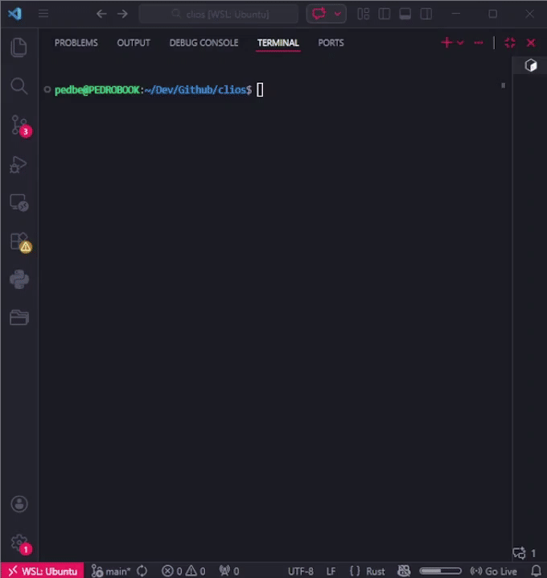
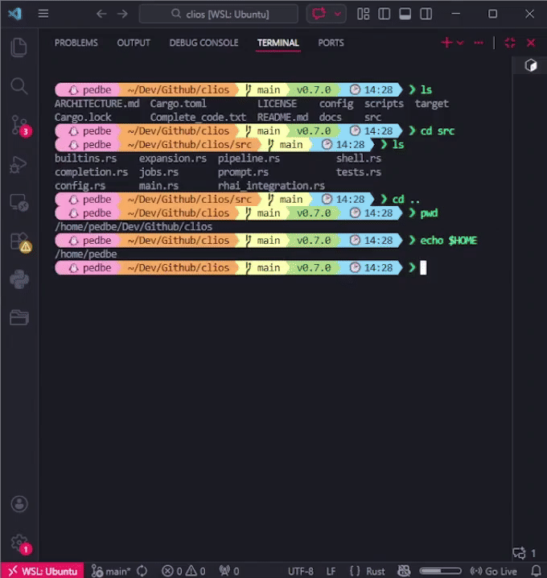

# Clios Shell

## A Modern, Scriptable System Shell in Rust

**Clios** (Command Line Interface & Operating System Shell) is a modern, extensible system shell written in **Rust**, designed with a strong focus on reliability, performance, and explicit control over system behavior. It targets Linux environments, including embedded and SBC-based systems, and prioritizes correctness, debuggability, and low-level understanding over abstraction-heavy automation.

The project explores how a traditional Unix-like shell can be rethought using modern systems programming practices, while remaining compatible with existing command-line workflows.

---

## Project Scope and Motivation

Clios was created as a **systems engineering project and technical study**, not as a commercial product or AI-driven shell. Its main goals are:

* Study shell internals such as parsing, job control, process management, and I/O redirection
* Apply Rust to low-level, stateful, interactive software
* Design a shell architecture that is **explicit, testable, and extensible**
* Explore scripting integration without sacrificing system safety

While Clios is stable and usable, it should be understood as a **Proof of Concept (PoC)** and an evolving technical project.

---

## Core Design Principles

* **Correctness over convenience** – predictable behavior and clear error messages
* **Explicit system interaction** – minimal hidden magic
* **Extensibility by design** – scripting via an embedded language
* **Compatibility** – works with standard Unix tools and workflows

---

## Key Features

* Execution of external system commands (`ls`, `grep`, `git`, etc.)
* Persistent command history stored in `~/.clios_history`
* Real-time syntax feedback (valid / invalid commands)
* Job control with background execution, `Ctrl+Z`, and `fg`
* Native scripting support using the **Rhai** embedded language
* Logical operators `&&` and `||`
* Git-aware prompt displaying the current branch
* I/O redirection: `>`, `>>`, `2>`
* Process pipelines using memory-based piping (`|`)
* Context-aware parser that correctly handles quoted arguments

---

## Safety Mechanisms and Error Handling

Clios includes explicit protections against common shell failure modes:

* Detection and prevention of recursive alias loops (depth limit enforced)
* Pipeline parsing that respects quoted segments
* Graceful handling of empty or malformed commands
* Clear error reporting for invalid subshell usage
* Validation of redirection targets and file access
* Plugin validation before execution
* Consistent, Unix-inspired error messages

These mechanisms are intended both for robustness and for learning how real shells defend against misuse.

---

## Built-in Commands

| Command              | Description                         |
| -------------------- | ----------------------------------- |
| `cd [dir]`           | Change directory (`cd -` supported) |
| `pwd`                | Print working directory             |
| `alias [name='cmd']` | Create or list aliases              |
| `unalias <name>`     | Remove alias                        |
| `export VAR=val`     | Set environment variable            |
| `unset VAR`          | Remove environment variable         |
| `source <file>`      | Load Rhai plugin                    |
| `plugins`            | List loaded plugins                 |
| `rhai [code]`        | Execute Rhai code                   |
| `history`            | Show command history                |
| `type <cmd>`         | Show command type                   |
| `fg <PID>`           | Resume job in foreground            |
| `version`            | Display version information         |
| `help`               | Display help                        |
| `exit`               | Exit the shell                      |

---

## Installation

### Recommended Method

```bash
git clone https://github.com/pedrohusky/clios-shell
cd clios-shell
./scripts/install.sh
```

The installer:

1. Builds the shell in release mode
2. Installs configuration files in `~/.cliosrc`
3. Installs example Rhai plugins in `~/.clios_plugins/`
4. Installs utility scripts in `~/.clios_scripts/`
5. Optionally installs the binary system-wide

### Requirements

* Rust (Cargo)
* Linux or WSL (macOS partially supported)

---

## Configuration Structure

```
~/.cliosrc
~/.clios_plugins/
~/.clios_scripts/
```

Plugins and scripts are intentionally simple and transparent, serving both as utilities and as examples for extension.

---

## Testing and Validation

Clios includes automated testing at multiple levels:

* Integration tests for interactive shell behavior
* Unit tests for core Rust components

```bash
./test_shell.sh
cargo test
```

All tests currently pass, and no known crashes are present in normal usage scenarios.

---

## Project Status

* **Status:** Stable for advanced usage and experimentation
* **Nature:** Technical study / Proof of Concept
* **Target audience:** Systems programming students, embedded Linux users, and low-level software enthusiasts

The project is actively evolving and intentionally conservative in scope. Features are only added when their behavior can be clearly specified and tested.

---

## Non-Goals

To keep the project focused, Clios intentionally does **not** aim to:

* Replace existing shells like Bash or Zsh
* Abstract away Unix concepts
* Provide AI-driven automation in its core

Experiments with local AI models were conducted separately and are **not** part of the current codebase.

---
## Demo




---

## License

MIT License
